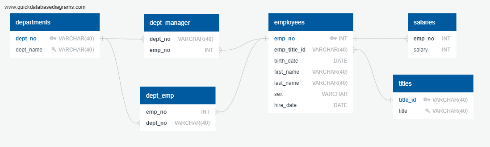
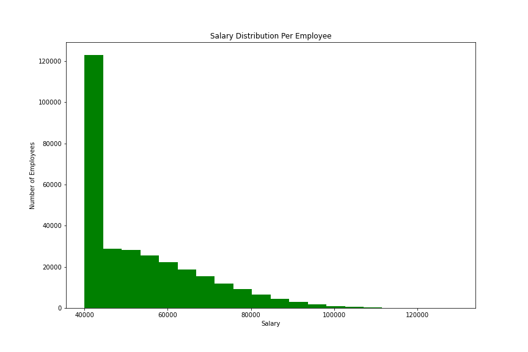
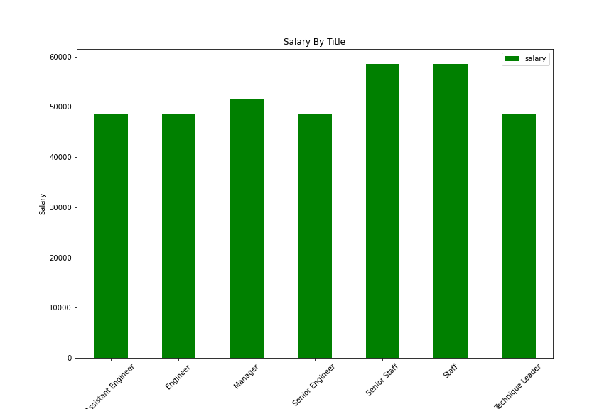

# Employee Database Creation and Analysis

- **_EmployeeSQL_** - A set of SQL files and seed data to create an employee database that includes employee titles, salaries and departments. We will run a series for SQL queries on this database to preview certain data.

- **_Bonus_** - [`Bonus.ipynb`](Bonus/Bonus.ipynb) is a Jupyter Notebook that uses employee data from the database created from the **_EmployeeSQL_** portion of the analysis. It uses SQLAlchemy in the jupyter notebook to load the data into a pandas dataframe so we can do some analysis on salary amounts and salaries by title.

## Files

- EmployeeSQL

  - [`QuickDBD-Source.txt`](EmployeeSQL/DDL/QuickDBD-Source.txt) - Text file that contains the meta-text for creating an entity relationship diagram using the tool from [Quick Database Diagrams](https://app.quickdatabasediagrams.com/).

  - [`create-objects.sql`](EmployeeSQL/DDL/create-objects.sql) - DDL file for creating tables, keys, and relationships.

  - Below you will find the seed data for each of the tables in [`create-objects.sql`](EmployeeSQL/DDL/create-objects.sql), order of importing is important. You may load the data in the same order as the tables are listed in [`create-objects.sql`](EmployeeSQL/DDL/create-objects.sql).

    - [`departments.csv`](EmployeeSQL/Resources/departments.csv)
    - [`titles.csv`](EmployeeSQL/Resources/titles.csv)
    - [`employees.csv`](EmployeeSQL/Resources/employees.csv)
    - [`dept_emp.csv`](EmployeeSQL/Resources/dept_emp.csv)
    - [`dept_manager.csv`](EmployeeSQL/Resources/dept_manager.csv)
    - [`salaries.csv`](EmployeeSQL/Resources/salaries.csv)

  - [`analysis.sql`](EmployeeSQL/Analysis-SQL/analysis.sql) - SQL file containing the 8 analysis queries. The file is commented please refer to the numbered sections for a description e.g. (x).

- Bonus

  - [`Bonus.ipynb`](Bonus/Bonus.ipynb) - Jupyter Notebook for the Bonus analysis for the histogram and bar charts

## Results

- Entity Relationship Diagram (ERD)

  

- Salary Histogram Chart

  

- Salary by Title Bar Chart

  

## Analysis

1. EmployeeSQL [Query 1 results](EmployeeSQL/Results/query-1-result.csv)

1. EmployeeSQL [Query 2 results](EmployeeSQL/Results/query-2-result.csv)

1. EmployeeSQL [Query 3 results](EmployeeSQL/Results/query-3-result.csv)

1. EmployeeSQL [Query 4 results](EmployeeSQL/Results/query-4-result.csv)

1. EmployeeSQL [Query 5 results](EmployeeSQL/Results/query-5-result.csv)

1. EmployeeSQL [Query 6 results](EmployeeSQL/Results/query-6-result.csv)

1. EmployeeSQL [Query 7 results](EmployeeSQL/Results/query-7-result.csv)

1. EmployeeSQL [Query 8 results](EmployeeSQL/Results/query-8-result.csv)

1. Bonus [Histogram](Bonus/Results/histogram-salary.png) shows that majority or employees making ~\$40k per year, seems like wealth needs to be distributed a bit better!

1. Bonus [Bar Chart](Bonus/Results/bar-salary-title.png) shows that those with a "Staff" or "Manager" title are making more, if I were an engineer I might ask why they aren't paid more since they make the products!

## Execution

1. The assumption is that you have a working Python 3.6 environment and:

   - Jupyter Notebook 6.1.4
   - pandas 1.0.5

1. Clone the [`git repository`](https://github.com/jayhjman/sql-challenge) for this project
1. Change into the [`repository directory`](https://github.com/jayhjman/sql-challenge) and then into [`WeatherPy`](WeatherPy/)
1. In the `WeatherPy` directory create a file called `config.py` and add the following 2 lines:

   - weather_api_key = "YOUR WEATHER API KEY HERE"
   - g_key = "YOUR GOOGLE MAPS API KEY HERE"

   Replace the values in the double quotes above with you version of the key you created in your source environments

## Author

Made by Jay with :heart: in 2020.
