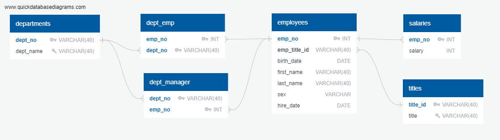

# Employee Database Creation and Analysis

- **_EmployeeSQL_** - A set of SQL files and seed data to create an employee database that includes employee titles, salaries and departments. We will run a series for SQL queries on this database to preview certain data.

- **_Bonus_** - [`Bonus.ipynb`](Bonus/Bonus.ipynb) is a Jupyter Notebook that uses employee data from the database created from the **_EmployeeSQL_** portion of the analysis. It uses SQLAlchemy in the jupyter notebook to load the data into a pandas dataframe so we can do some analysis on salary amounts and salaries by title.

## Files

- EmployeeSQL

  - [`QuickDBD-Source.txt`](EmployeeSQL/DDL/QuickDBD-Source.txt) - Text file that contains the meta-text for creating an entity relationship diagram using the tool from [Quick Database Diagrams](https://app.quickdatabasediagrams.com/)

  - [`create-objects.sql`](EmployeeSQL/DDL/create-objects.sql) - DDL file for creating tables, keys, and relationships.

  - Below you will find the seed data for each of the tables in [`create-objects.sql`](EmployeeSQL/DDL/create-objects.sql), order of importing is important. You may load the data in the same order as the tables are listed in [`create-objects.sql`](EmployeeSQL/DDL/create-objects.sql)

    - [`departments.csv`](EmployeeSQL/Resources/departments.csv)
    - [`titles.csv`](EmployeeSQL/Resources/titles.csv)
    - [`employees.csv`](EmployeeSQL/Resources/employees.csv)
    - [`dept_emp.csv`](EmployeeSQL/Resources/dept_emp.csv)
    - [`dept_manager.csv`](EmployeeSQL/Resources/dept_manager.csv)
    - [`salaries.csv`](EmployeeSQL/Resources/salaries.csv)

- Bonus

  - [`Bonus.ipynb`](Bonus/Bonus.ipynb) - Jupyter Notebook for the Bonus analysis for the histogram and bar charts

## Results

- Entity Relationship Diagram (ERD)

  

## Analysis

1. Analysis 1.

1. Analysis 2.

## Execution

1. The assumption is that you have a working Python 3.6 environment and:

   - Jupyter Notebook 6.1.4
   - matplotlib 3.2.2
   - pandas 1.0.5
   - numpy 1.18.5
   - requests 2.24.0
   - scipy 1.5.0
   - citipy 0.0.5
   - gmaps 0.9.0

1. Clone the [`git repository`](https://github.com/jayhjman/python-api-challenge) for this project
1. Change into the [`repository directory`](https://github.com/jayhjman/python-api-challenge) and then into [`WeatherPy`](WeatherPy/)
1. In the `WeatherPy` directory create a file called `api_keys.py` and add the following 2 lines:

   - weather_api_key = "YOUR WEATHER API KEY HERE"
   - g_key = "YOUR GOOGLE MAPS API KEY HERE"

   Replace the values in the double quotes above with you version of the key you created in your source environments

1. Repeat the step above for the [`VacationPy`](VacationPy/) directory
1. Open up Jupyter Notebook now in the top level directory [`repository directory`](https://github.com/jayhjman/python-api-challenge)
   - Part I - Change directories in the Jupyter Notebook to [`WeatherPy`](WeatherPy/) and execute [`WeatherPy.ipynb`](WeatherPy/WeatherPy.ipynb) (Remember this must be done before Part II as `WeatherPy` produces a file `VacationPy` needs)
   - Part II - Change directories in the Jupyter Notebook to [`VacationPy`](VacationPy/) and execute [`VacationPy.ipynb`](VacationPy/VacationPy.ipynb)

## Author

Made by Jay with :heart: in 2020.
